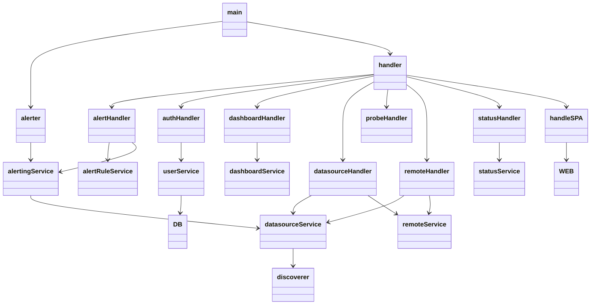

```mermaid
classDiagram

main --> alerter
main --> handler

alerter --> alertingService

handler --> alertHandler
handler --> authHandler
handler --> dashboardHandler
handler --> datasourceHandler
handler --> probeHandler
handler --> remoteHandler
handler --> statusHandler
handler --> handleSPA 
handleSPA --> WEB

alertHandler --> alertRuleService
alertHandler --> alertingService

authHandler --> userService

dashboardHandler --> dashboardService

datasourceHandler --> datasourceService
datasourceHandler --> remoteService

remoteHandler --> datasourceService
remoteHandler --> remoteService

statusHandler --> statusService

alertingService --> datasourceService

datasourceService --> discoverer

userService --> DB
```
